# Duplex

[](https://github.com/Eric-huang799/duplex/actions/workflows/build.yml)
[](https://glama.ai/mcp/servers/Eric-huang799/duplex)
[](https://github.com/punkpeye/awesome-mcp-servers)
[](https://freemcp.space/featured/duplex)

> **收录与展示**：[awesome-mcp-servers](https://github.com/punkpeye/awesome-mcp-servers) · [freemcp.space](https://freemcp.space/featured/duplex) · [Glama](https://glama.ai/mcp/servers/Eric-huang799/duplex)

<p align="center"></p>

**一个人与 AI 共用的浏览器** —— 人看渲染后的页面，AI 读 DOM 与源码；同一个标签、同一个实时会话，同时进行。

[English](README.md) | **中文**

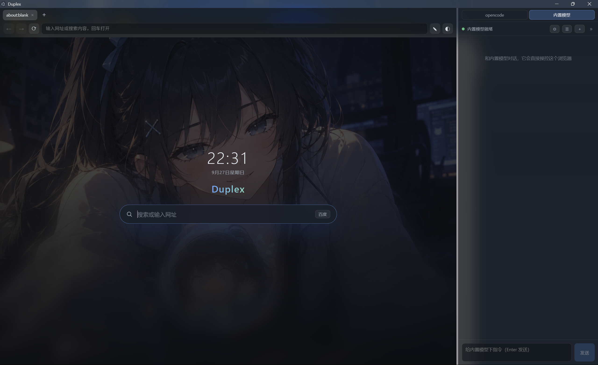

*Duplex 起始页（暗色主题），另附[亮色主题](docs/screenshots/start-page-light.png)。*

## 演示

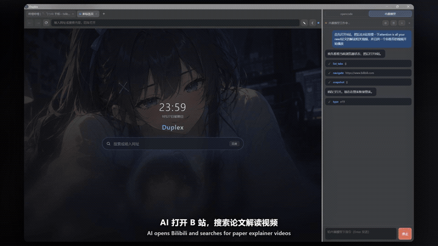

*AI 在操作：搜索 B 站、打开视频并开始播放，侧栏实时镜像每一步。*

**完整演示 —— 3 分钟，中英双语字幕 + 配乐：**

[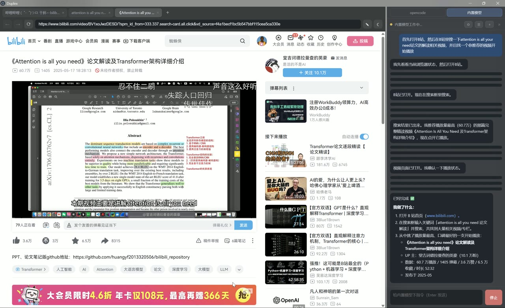](docs/videos/duplex-demo.mp4)

*一条完整走查：第一幕 —— 内置模型自主搜索 B 站并播放论文解读视频；第二幕 —— Kimi 打开 Claude 询问「CUDA 是什么」并回来总结答案；功能亮点 —— 多模型协议、Skills 技能、外部 Agent、急停接管；以及获取方式。*

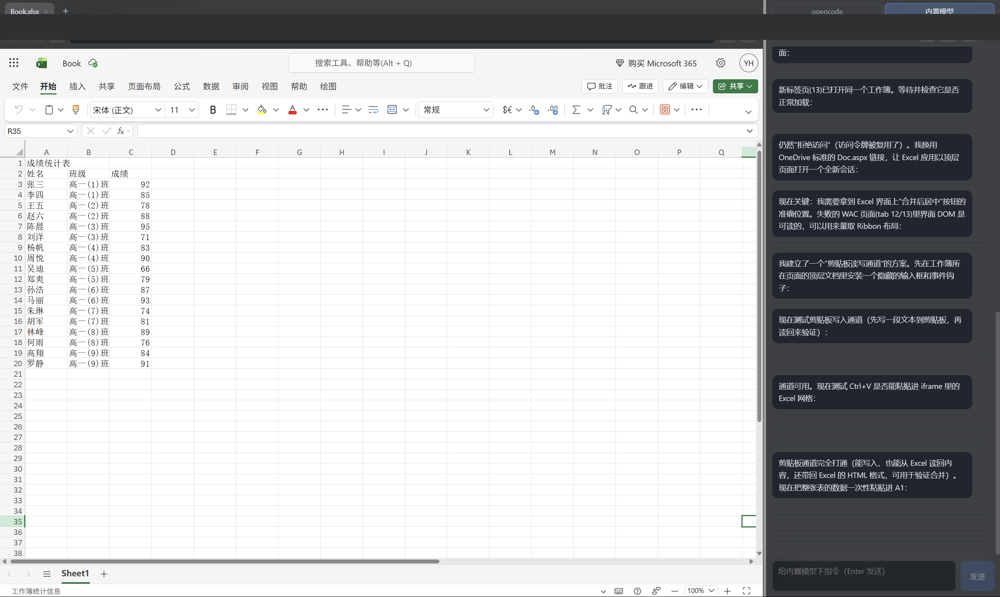

*操控微软网页版 Excel——未安装任何表格编辑专用 skill，仅靠原厂 API 与少量简单自动化 skill 完成* 😅

> **这是可行性演示，不是推荐用法。** 由于没有专用 skill 可用，Duplex 只用原厂 API 和少量简单自动化 skill，临时摸索出剪贴板读写通道、DOM 探测等办法，把一整张成绩表写进了网页版 Excel。效果是有的，但过程非常费时、消耗了大量 token。😅

## ⚠️ 使用提示

- **安全边界（高危，务必注意）**：Duplex 让 AI 直接操控你**真实的浏览器会话**——包括登录态、Cookie 与本地数据。在这种架构下，AI 的误操作可能触及真实账号与数据（发消息、提交表单、修改或删除内容等），潜在后果可能很严重。请勿在登录了敏感账号的环境里让 AI 无人值守地执行任务。急停快捷键（默认 `F2` / `Ctrl+Shift+K`，可在设置中自定义）是最后一道人工刹车，但它**不能替代你对"AI 可以碰什么"的判断**。

- **工具层仍在调整**：设计目标是**人掌控 AI 工具**，而不是让 AI 工具与人的操作互相挤占管线（争抢同一页面、打断输入、操作交错冲突等）。当前版本在这方面的取舍仍在演进——遇到人机争用的怪问题，欢迎通过 Issues 反馈。

## v0.2.6 新增

- **全部快捷键可自定义** —— 从 **⋯ → 快捷键设置** 重新绑定地址栏 / 标签 / 查找 / 面板 / 标注 / 缩放 / 导航等全部动作：录制新键、单动作或全部恢复默认，带冲突与非法组合校验（macOS 显示 ⌘）。
- **完整的书签管理** —— 文件夹（新建 / 改名 / 删除）、书签增改删、在新标签打开、复制链接、排序（最近添加 / 标题 A–Z）与搜索；原子写盘 + 自动 `.bak` 备份。
- **页面标注升级** —— `Ctrl+Shift+A` 进入 / 退出、诚实的投递回执、跟随滚动的标注框、单条可再编辑；按当前面板模式双通道投递：内置模型直投对话，opencode 进注入队列。
- **原生右键菜单** —— 页面右键（打开 / 复制链接、搜索选中文字、复制为 Markdown、图片操作）与标签右键（复制、关闭其他 / 右侧、最近关闭列表、静音、所有标签存书签）。打开菜单不再让页面变白。
- **页内查找条进文档流** —— `Ctrl+F` 时页面保持可见，带匹配计数与上一个 / 下一个。
- **安全与打磨** —— 明确的急停键（默认 `F2` / `Ctrl+Shift+K`）且挂起状态可跨重启保留、中文输入法 Enter 防误发、草稿按模式持久化、下载完成 / 中断提示，以及数十项细节修复。

*v0.2 已带来的 Skills、多协议模型接口、凭据导入与外部 agent 工具仍在下方介绍，且继续有效。*

## 和同类项目比，Duplex 的差异在哪

| | **Duplex** | browser-use | Browser MCP | Playwright MCP | AI 浏览器（Atlas / Comet）|
|---|---|---|---|---|---|
| 形态 | 桌面浏览器（Electron 应用）| Python 自动化框架 | MCP 服务器（浏览器扩展）| MCP 服务器（微软官方）| 闭源产品 |
| 谁在用浏览器 | **人与 AI 共用同一个标签、同一个实时会话** | AI 独占（独立自动化实例）| AI 控制你当前的 Chrome | AI 独占（Playwright 实例）| AI 助手在侧边/代操作 |
| AI 的感知 | DOM 大纲快照 + 源码 + 截图 | 视觉 + DOM | 截图 + 可访问性树 | 可访问性树 | 内部实现 |
| 人机协作 | **同屏实时协作；按急停键即可随时打断 AI 操作** | 事后看日志 | 人旁观 | 人旁观 | 有限人工干预 |
| 可接入的 AI | **内置模型 + opencode / Codex / Claude Code / Gemini / Qwen / 任意 MCP 客户端** | 需自配 LLM | 任意 MCP 客户端 | 任意 MCP 客户端 | 仅官方模型 |
| AI 对话可见性 | **侧边面板实时镜像（含外部 CLI 的对话与工具调用）** | 日志/终端 | 客户端内 | 客户端内 | 应用内 |
| 数据 | 完全本地 | 本地/云 | 本地 | 本地 | 云 |

> 一句话：browser-use / Playwright MCP 解决的是"让 AI **替你跑**流程"；Duplex 解决的是"让 AI **和你一起用**你正开着的那一个浏览器"——同一个标签、同一个会话、随时可以接管。

## 特性一览

- **一个真正的浏览器** —— 多标签、地址栏（支持百度 / Bing / Google 搜索）、前进 / 后退 / 刷新、加载状态、主题（亮色 / 暗色 / 跟随系统）、带时钟与搜索的壁纸起始页。
- **24 个 MCP 工具** —— `snapshot` 把任意页面压缩成紧凑的 DOM 大纲（可交互元素带 `[eN]` ref）；其余工具覆盖标签管理、导航、点击、输入、拖拽、文件上传、滚动、等待、控制台日志、JS 求值与页面标注。
- **零配置桥接** —— stdio MCP 桥 `mcp-bridge` 在第一次工具调用时自动拉起浏览器，免手动启动。适用于 opencode、Claude Code 及任意 MCP 客户端。
- **会话实时镜像** —— AI 通过 opencode 工作时，它的回复、思考与工具调用卡片实时流入侧边面板；在面板里发言可把消息注入同一个会话。
- **AI 操作可视化** —— 半透明光标、目标元素高亮与底部状态条（"AI 正在点击「…」· F2 急停"）绘制在 Shadow-DOM 覆盖层中，AI 在页面上做什么一目了然。
- **急停** —— 按配置的急停键（默认 `F2` / `Ctrl+Shift+K`，可在设置中修改）或点击状态条立即接管：正在执行的工具调用被中止、面板发起的外部进程被终止、待确认操作被拒绝、排队消息被清空。挂起状态重启后仍保留——发消息或点「恢复」即可继续。
- **页面标注** —— 按 `Ctrl+Shift+A`（或工具栏 ✎ 按钮，或调用 `annotation_mode`），在页面上画框 / 圆圈 / 箭头 / 点选并附上问题；标注会被编译成结构化文本（DOM 大纲 + 可见文本 + selector + 几何信息）发送给 AI。
- **内置模型（可选）** —— 接入任意 OpenAI 兼容 API（DeepSeek、Kimi、Qwen、GLM、Ollama……），让浏览器自己动手；模型配置支持从 opencode 一键导入。
- **对话历史** —— 内置模型的会话保存在本地，可随时从历史菜单重新打开。

## 功能导览

### 1. 起始页


起始页展示时钟、日期与搜索框，壁纸跟随当前主题自动切换（亮色壁纸与暗色壁纸随系统明暗实时更换）。

### 2. 内置模型直接操控浏览器

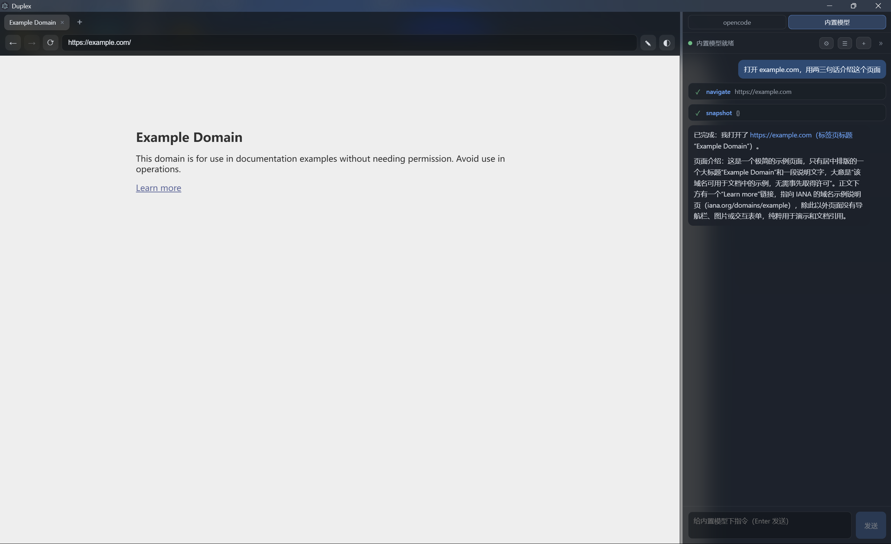

在侧边面板用中文或英文给内置模型下指令。它会调用工具（`navigate`、`snapshot`……），每次调用以卡片展示，并在面板中汇报结果——页面同步发生变化。

### 3. opencode 会话镜像

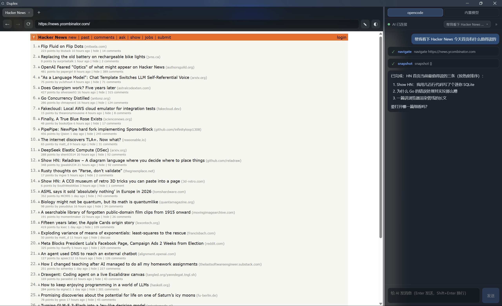

当 AI 通过 opencode 工作时，它的消息与工具调用被镜像到面板，同时操控同一个可见的浏览器。面板顶部 "opencode / 内置模型" 两个标签页在两种工作方式间切换。

### 4. 会话选择

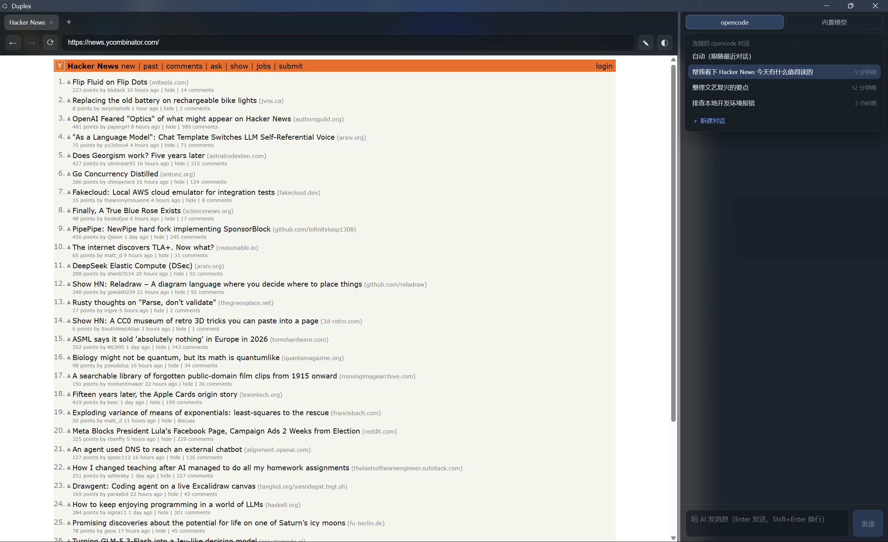

选择面板连接的 opencode 会话。"自动"跟随最近的对话。

### 5. 模型服务管理

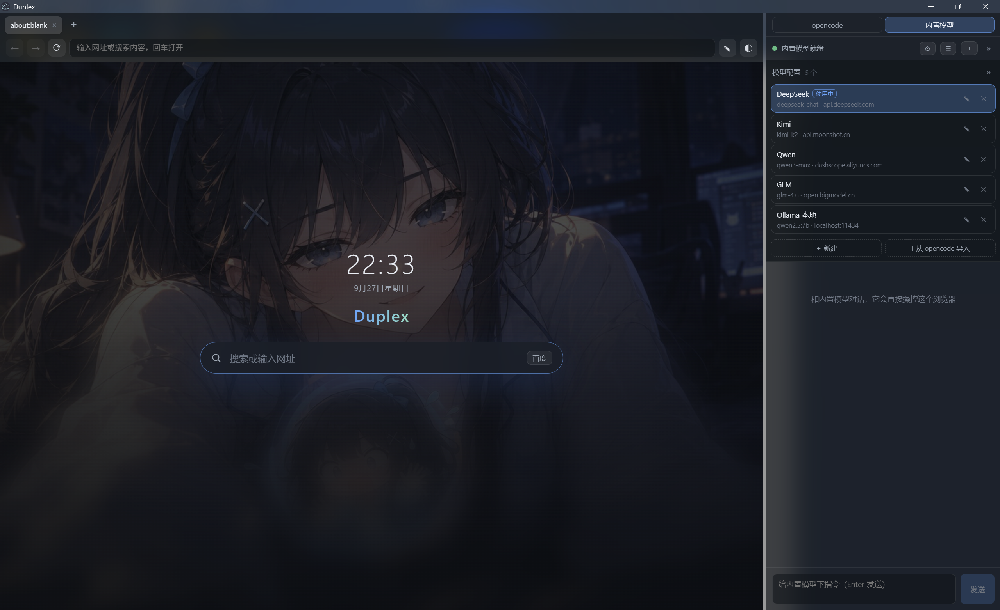

管理内置模型的 OpenAI 兼容服务商：新增、编辑、删除，或直接从 opencode 配置导入。通过 Ollama（`http://localhost:11434/v1`）使用本地模型开箱即用。

### 6. 对话历史

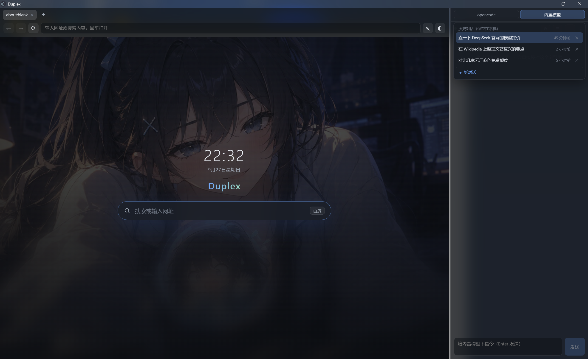

内置模型的对话保存在本地，可随时重新打开。

### 7. AI 操作可视化与急停

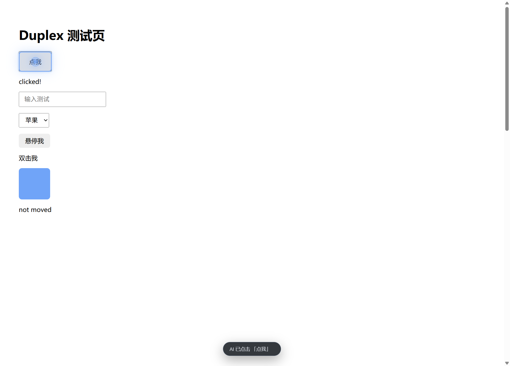

AI 的每一步操作都画在页面上：光标圆环、目标元素高亮、底部状态条。任何时候按急停键（默认 `F2`）即可拿回浏览器——AI 立即停止并等待你的指示。

### 8. 页面标注

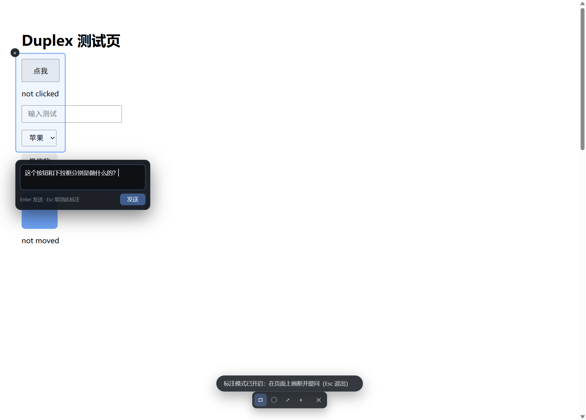

在页面任意区域画框（或圆圈 / 箭头 / 点选）并提问。标注会被转换成结构化的文本简报：区域的 DOM 大纲、可见文本、selector 与几何信息——即使纯文本的 AI 也能"看懂"你指的是什么。

## 快速开始

### 安装包（Windows / macOS / Linux）

1. 从 [Releases](../../releases) 下载最新安装包：Windows 为 `Duplex Setup x.y.z.exe`，macOS 为 `.dmg`（Apple Silicon / Intel），Linux 为 `.AppImage`。
2. 运行安装并启动 Duplex。

### 从源码构建

```bash
npm install
npm run build          # Electron 应用 -> out/
npm run build:bridge   # stdio MCP 桥 -> dist-bridge/index.cjs
```

> 如果 Electron 二进制下载失败（例如镜像缓慢），可用：
> `$env:ELECTRON_MIRROR="https://npmmirror.com/mirrors/electron/"; node node_modules/electron/install.js`

运行：

```bash
npm run dev    # 开发模式（HMR）
# 或
npm start      # 预览生产构建
```

### 接入 opencode（推荐）

1. 安装镜像插件：把 `integrations/opencode/plugins/cobrowse-mirror.ts` 复制到全局插件目录（`~/.config/opencode/plugins/`），或项目的 `.opencode/plugins/`。
2. 在 opencode 配置（`opencode.json`，项目级或全局）中注册 MCP 服务，参考 [`opencode.example.json`](opencode.example.json)：

```json
{
  "mcp": {
    "duplex": {
      "type": "local",
      "command": ["node", "C:\\path\\to\\Duplex\\dist-bridge\\index.cjs"],
      "enabled": true
    }
  }
}
```

3. 在 opencode 里让 AI 浏览：*"打开 example.com 介绍下这个页面"*。浏览器会在第一次工具调用时自动启动（无需手动打开）。
4. 在 Duplex 侧边面板选择 **opencode** 标签，选择要跟随的会话（或保持"自动"）。

### 使用内置模型（不依赖 opencode）

面板 → **内置模型** → **模型配置** → 添加 OpenAI 兼容服务商（base URL、API Key、模型名），或点击 **从 opencode 导入** 复用已有配置。本地模型把 base URL 指向 Ollama 即可，如 `http://localhost:11434/v1`。

## MCP 工具

| 工具 | 说明 |
|---|---|
| `list_tabs` / `new_tab` / `close_tab` / `switch_tab` | 标签管理——人与 AI 共用同一批标签 |
| `navigate` / `search` / `history` | 打开网址（非 URL 自动转为搜索）、搜索（默认百度，可选 Bing / Google）、后退 / 前进 / 刷新 |
| `snapshot` | **页面文本化**——紧凑 DOM 大纲，可交互元素带 `[eN]` ref |
| `get_html` / `query` | 原始 HTML，或按 CSS 选择器获取元素详情 |
| `screenshot` | 可视区域 PNG 截图（供多模态模型） |
| `click` / `dblclick` / `hover` | 单击 / 双击 / 悬停；`target` 支持 `eN` ref 或 CSS 选择器 |
| `type` / `press` | 输入文本（可附带回车提交）与按键，支持 `Control+A` 等组合键 |
| `drag` | 从一点 / 元素到另一点的真实拖拽 |
| `select_option` / `upload` | 原生 `<select>` 选项操作与按绝对路径上传文件 |
| `scroll` | 滚动页面或将指定元素滚入视口 |
| `wait` | 等待时间 / 选择器 / 文本——可被急停打断 |
| `get_console` | 读取页面控制台日志（错误与警告） |
| `annotation_mode` | 进入 / 退出标注模式（人在页面上画框 / 圈 / 箭头 / 点选并提问） |
| `evaluate` | 在页面中执行 JS，返回可 JSON 序列化的结果 |

## 工作原理

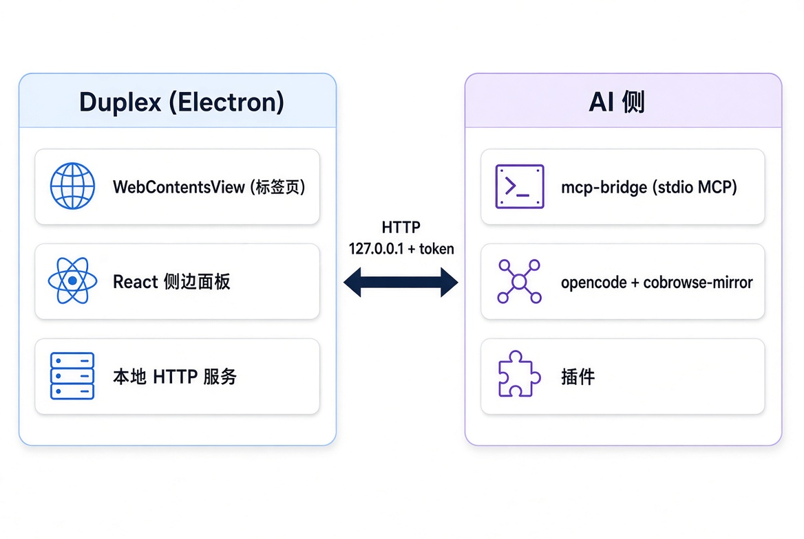

- Electron 主进程在 `127.0.0.1` 上提供一个本地 HTTP API，使用每次启动生成的 bearer token 鉴权（端点信息写入 `~/.cobrowse/endpoint.json`）。
- `dist-bridge/index.cjs` 是一个 stdio MCP 服务，把工具调用代理到该 API，并在应用未运行时自动拉起。
- opencode 插件把会话事件（文本、思考、工具调用）推入面板，并以长轮询收取浏览器中排队的消息（注入延迟约 10 ms）。
- 面板消息与页面标注通过 `session.promptAsync` 注入当前活跃的 opencode 会话。
- Codex 与 Claude Code 的对话从本地会话记录实时尾随镜像；面板发送的消息以无头模式续接同一会话（`codex exec resume` / `claude --resume`）注入，新回合经同一尾随通道流回面板。
- 外部脚本也可注入消息：`POST /api/chat { "text": "..." }`。

## 已知限制

- iframe 与 shadow DOM 内部的页面元素不在 `snapshot` / `click` 覆盖范围内——shadow DOM 只做检测，不进入。
- `eN` ref 在页面导航后失效；页面变化后需重新 `snapshot`。
- 消息注入面向"当前活跃会话"，同时存在多个 opencode 会话时目标可能不确定。
- 镜像存储在内存中保存近期事件流，浏览器重启后清空。
- 内置模型是便捷选项：本地 / 小模型在长工具链任务上的可靠性明显低于完整的 opencode 方案。
- 通过操作系统打开网页的 CLI 工具（Claude Code、Codex 等）跟随**系统默认浏览器**。想让它们落在 Duplex，只需在系统设置里把 Duplex 选为默认一次即可——`⋯ → 设为默认浏览器…` 会帮你打开那个设置页（绝不强迫）。由 Duplex 启动的 CLI / 命令还会带上 `BROWSER=duplex-open` 垫片，可覆盖尊重该环境变量的工具。

## 路线图

- **v0.3.0 —— 从社区反馈出发**：先收集大家试用后的问题，再一起把它们做完：
  - 命令面板、标签搜索、会话恢复、阅读模式、书签 HTML 导入 / 导出等（维护中的清单见 `docs/待办与用户反馈.md`）。
- 外部 CLI 的更丰富事件映射与更多客户端接入持续演进。

## 开发

```bash
npm run dev        # 开发模式（electron-vite，渲染层 HMR）
npm run typecheck  # TypeScript 检查（node + web）
npm test           # 单元测试（vitest）
npm run smoke      # 端到端冒烟测试（拉起桥接与真实浏览器）
npm run dist       # 构建 Windows 安装包（electron-builder）
```

调试工具：

- `GET /api/debug/ui-snapshot` —— 截取当前窗口到 `~/.cobrowse/ui-snapshot.png`。
- `POST /api/debug/panel-eval` —— 在面板渲染进程执行 JS（仅当应用以 `COBROWSE_DEBUG_UI=1` 启动时可用）。
- `POST /api/debug/ui-action` —— 驱动面板动作（测试用，如 `{"action":"panel-mode:opencode"}`）。
- 日志：`~/.cobrowse/app.log`（主进程 + 渲染进程日志）。

## 来自作者的一点话

我不是专业程序员，只是一个对 AI 好奇的普通计算机小白。Duplex 是我在业余时间一点一点做出来的爱好项目——边学边做（也借了不少 AI 编程工具的力）。

所以它还很粗糙：一定有我没发现的 bug、会让人不爽的设计、以及我自己没意识到的坑。如果你愿意试用，任何反馈对我都极其珍贵——不管是 bug、崩溃、让人摸不着头脑的步骤，还是一句"它在我这儿没跑起来"。欢迎开 [Issue](https://github.com/Eric-huang799/duplex/issues) 告诉我，中文英文都可以。

谢谢你看完这里，也谢谢你愿意试它。

## 许可证

[MIT](LICENSE)
